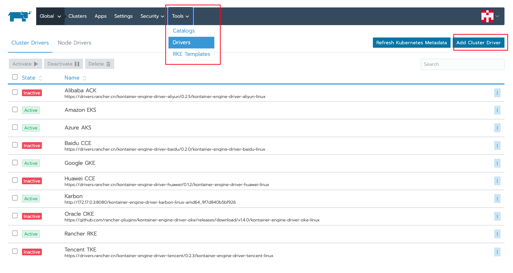

Kontainer Engine Karbon Driver
===============================

**Note**: This is NOT a Nutanix supported plugin.

**Note**: The Karbon API's (2.0) used in this version are NOT supported.

This document will describe how to use the Rancher Kontainer Engine Karbon Driver. This custom driver has been written for Nutanix Karbon 2.0 (version for 2.1 will follow). 

The UI plugin code can be found here:
	https://github.com/yannickstruyf3/ui-cluster-driver-nutanix

# Prerequisites
* Have working Rancher 2.0 installation
* Karbon 2.0 enabled on Prism Central
* Optional: use a webserver for hosting the UI files

For the steps on how to host the UI on your own webserver, please go to following link and refer to the `Building` section: 
https://github.com/yannickstruyf3/ui-cluster-driver-nutanix/blob/master/README.md

# Installation

Login on your rancher instance and go to `Tools` and select `Drivers`

## Building

`make`

Will output driver binaries into the `dist` directory, these can be imported 
directly into Rancher and used as cluster drivers.  They must be distributed 
via URLs that your Rancher instance can establish a connection to and download 
the driver binaries.  For example, this driver is distributed via a GitHub 
release and can be downloaded from one of those URLs directly.

